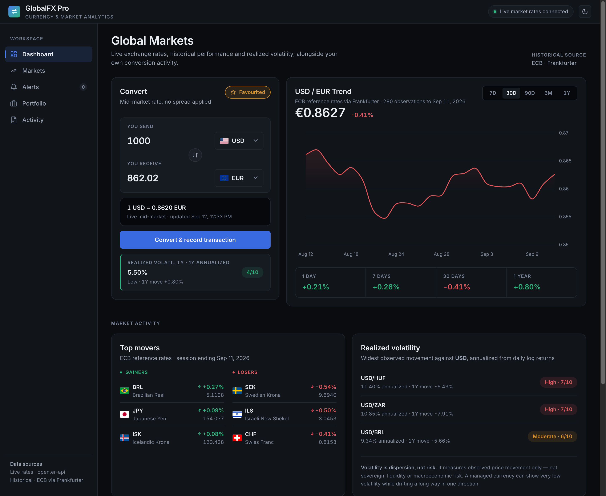
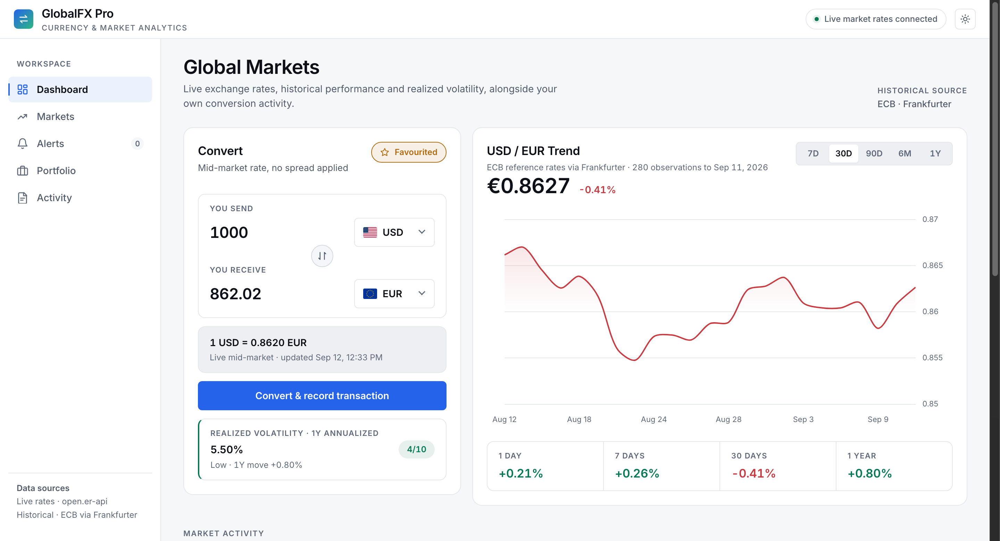
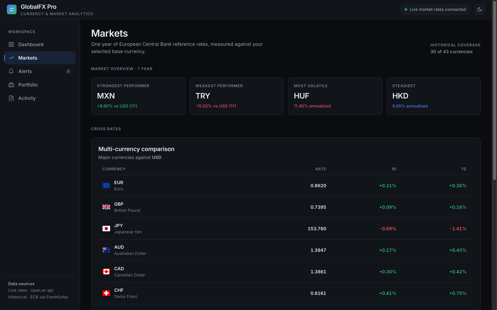
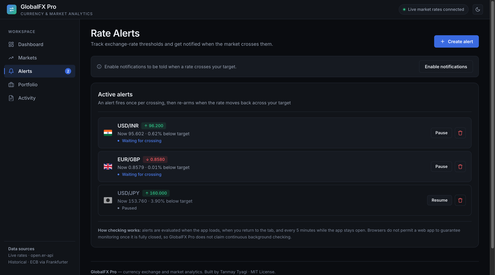
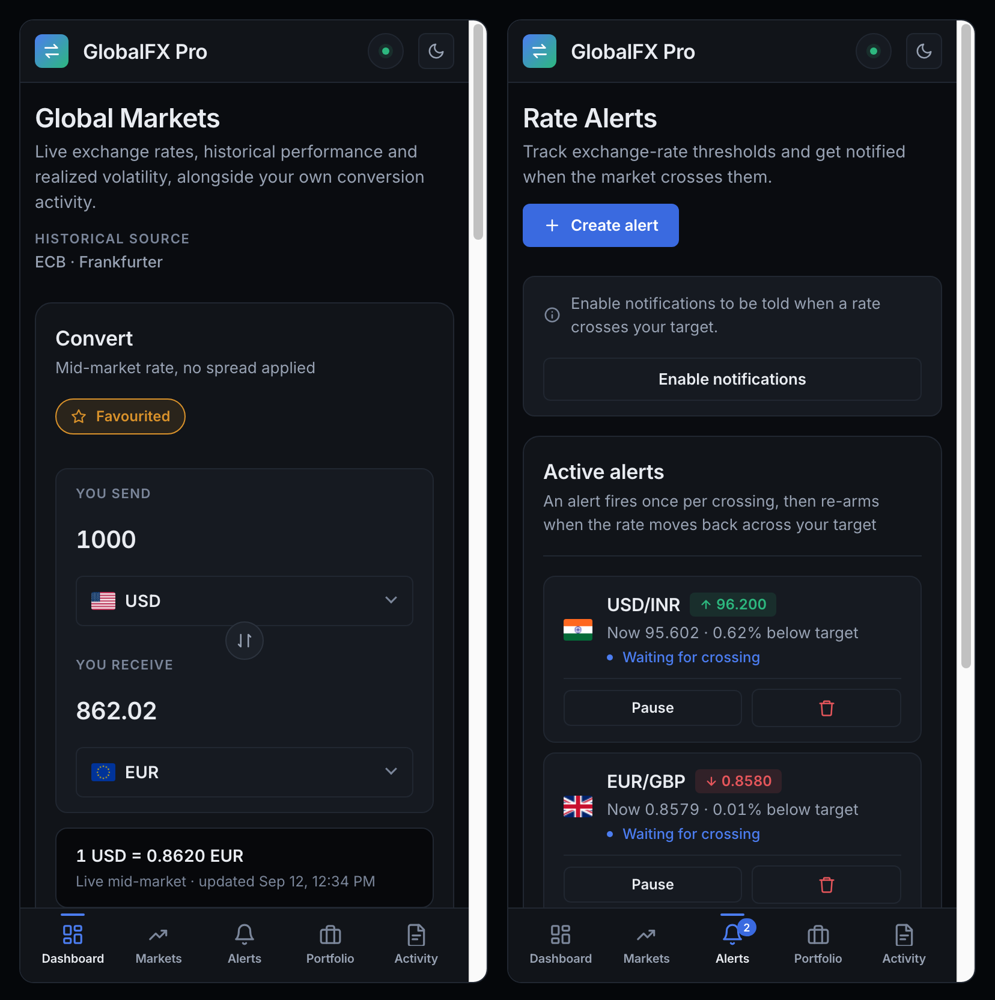
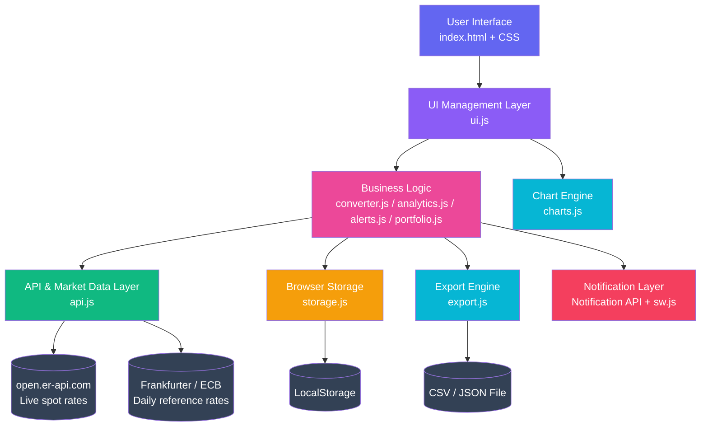
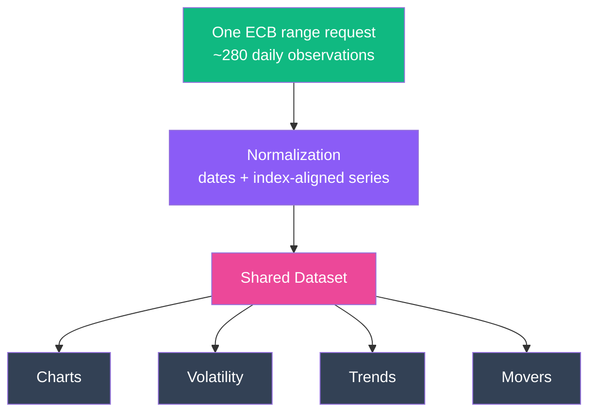
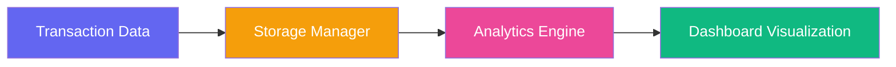
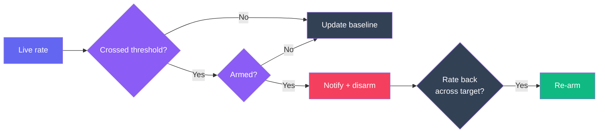

<div align="center">

# 💱 GlobalFX Pro

### Real-Time Global Currency Exchange & Financial Analytics Platform

*A production-grade fintech dashboard engineered with vanilla JavaScript — real ECB market data, no frameworks, no simulated numbers.*

[](https://developer.mozilla.org/en-US/docs/Web/JavaScript)
[](https://developer.mozilla.org/en-US/docs/Web/HTML)
[](https://developer.mozilla.org/en-US/docs/Web/CSS)
[](https://www.chartjs.org/)
[](https://github.com/tanmaytyagii/GlobalFX-Pro)
[](https://frankfurter.dev)
[](LICENSE)

[](https://github.com/tanmaytyagii/GlobalFX-Pro.git)
[](https://github.com/tanmaytyagii/GlobalFX-Pro/stargazers)
[](https://github.com/tanmaytyagii/GlobalFX-Pro/issues)

[Live Demo](#) · [Report Bug](https://github.com/tanmaytyagii/GlobalFX-Pro/issues) · [Request Feature](https://github.com/tanmaytyagii/GlobalFX-Pro/issues)

</div>

---

## 📸 Product Showcase

<div align="center">

| Dashboard — Dark | Dashboard — Light |
|:---:|:---:|
|  |  |

| Markets | Rate Alerts |
|:---:|:---:|
|  |  |

| Mobile — Dashboard & Alerts |
|:---:|
|  |

</div>


---

## 🎯 Product Overview

**GlobalFX Pro** is a real-time currency exchange and financial analytics platform built to demonstrate how a modern fintech product — comparable in spirit to **Wise, Revolut, Stripe, and Google Finance** — can be engineered entirely on the frontend using disciplined, modular vanilla JavaScript.

### The Problem

Cross-border commerce, remote payroll, freelance invoicing, and personal travel all require fast, accurate, and transparent currency conversion. Most "quick converter" tools online are single-purpose, offer no historical context, and give users no way to understand *why* a rate moved or *how* their own conversion behavior trends over time. GlobalFX Pro closes that gap by pairing a conversion engine with a full analytics layer in one cohesive interface.

### Real-World Use Cases

- **Freelancers & remote workers** reconciling international invoices across currencies
- **Travelers** planning budgets against live exchange rates before a trip
- **Import/export businesses** tracking currency exposure and volatility risk
- **Finance students & analysts** studying historical FX trends across multiple timeframes
- **Personal finance users** maintaining an auditable log of their own conversions

### Target Audience

Individuals and small businesses who need trustworthy, real-time FX data with the analytical depth of an institutional dashboard — without the overhead of a backend account or subscription.

### Why This Application Matters

GlobalFX Pro is positioned as a **fintech dashboard product**, not a demo script. Its defining constraint is data integrity: every market figure on screen is computed from real observations published by the European Central Bank, and anything that cannot be computed is labelled unavailable rather than filled in. A dashboard with fewer metrics and real data is worth more than one full of convincing numbers.

Every engineering decision — a single shared dataset, tiered caching, explicit data-provenance states, defensive parsing of persisted state, offline fallback to real cached data — reflects patterns used in production financial software, making the codebase a realistic reference implementation of client-side fintech engineering.

---

## ⭐ Key Features

| Feature | Description | Engineering Highlight |
|---|---|---|
| **Currency Conversion** | Real-time conversion across 43 world currencies with live rate fetching | Cache-first layer with a TTL, falling back only to previously retrieved real rates |
| **Real Historical Charts** | ECB daily reference rates across 7D / 30D / 90D / 6M / 1Y | One range request serves every chart, metric and mover — no per-pair fetching |
| **Realized Volatility** | Annualized volatility computed from daily logarithmic returns | Sample standard deviation of ln(Pₜ/Pₜ₋₁), annualized over 252 trading days |
| **Rate Alerts** | Threshold alerts with browser notifications when a pair crosses your target | Edge-triggered crossing detection with re-arming, so an alert fires once per crossing |
| **Top Movers** | Best and worst performing currencies over the latest session | Ranked on the inverted quote, so a currency's own gain is measured, not its rate's rise |
| **Portfolio Tracker** | Multi-currency holdings valued in any base currency | Holdings that cannot be priced are excluded rather than silently valued at parity |
| **Analytics Dashboard** | Conversion statistics, most-used pairs, and average transaction size | Client-side aggregation computed entirely from local transaction history |
| **Data Provenance** | Every figure is labelled live, cached, or unavailable | Explicit state machine — missing data renders as "—", never as a plausible zero |
| **Currency Search** | Searchable selector with country flags and code/name matching | Debounced input handling for optimized keystroke-level performance |
| **Theme System** | Seamless dark/light mode switching across the entire interface | CSS custom-property architecture enabling instant, flicker-free theme swaps |
| **Transaction Logs** | Persistent, auditable record of every conversion performed | LocalStorage abstraction with schema validation on every read |
| **CSV / JSON Export** | One-click export of transaction history for offline record-keeping | RFC 4180 quoting; no external dependencies |
| **Offline PWA** | Installable, works offline with the last retrieved real data | Service worker: cache-first shell, network-first market data |
| **Adaptive Navigation** | A side rail on desktop, a bottom bar on tablet and mobile | One grid re-slots the same nodes — no duplicated navigation to keep in sync |
| **Dual Themes** | Dark and light, each designed independently | Fully tokenised; all text verified at WCAG AA in both |

---

## 🏗️ System Architecture

GlobalFX Pro follows a strict **layered frontend architecture**, separating presentation, orchestration, business logic, external communication, and persistence into independent concerns:

```
User Interface
       │
       ▼
UI Management Layer
       │
       ▼
Business Logic Modules
       │
       ▼
API Service Layer
       │
       ▼
Browser Storage
```

This separation ensures that UI changes never leak into business logic, business logic never talks to the DOM directly, and the API layer is fully swappable without touching the rest of the application.



### One Dataset, Many Consumers

The historical engine issues **a single range request** for the whole currency
universe and normalizes it once. Charts, volatility, trends and movers all read
from that one dataset — there is no per-currency fetching and no second series
generated anywhere.



Any pair `A/B` is derived from the EUR-based dataset as `EUR→B ÷ EUR→A`, which
reproduces the provider's own direct quotes to within 0.006% (rounding in the
published reference rates).

---

## 🔄 Application Workflow

### Currency Conversion Flow


1. **User Selects Currencies** — Base and target currencies are chosen via the searchable selector
2. **Fetch Exchange Rates** — `api.js` retrieves live rates, checking cache validity first
3. **Process Conversion** — `converter.js` performs the calculation and formats the result
4. **Save Transaction** — The conversion record is persisted via `storage.js`
5. **Update Analytics** — `analytics.js` recalculates aggregate metrics in real time

### Analytics Flow



1. **Transaction Data** — Raw conversion events generated during app usage
2. **Storage Manager** — `storage.js` normalizes and persists records to LocalStorage
3. **Analytics Engine** — `analytics.js` computes trends, frequency, and volatility scores
4. **Dashboard Visualization** — `charts.js` and `ui.js` render the results as live charts and metrics

### Rate Alert Flow



An alert is **edge-triggered**: it fires on the transition across the threshold,
not while the condition merely remains true. After firing it disarms, and only
re-arms once the rate returns to the other side of the target. Setting an alert
for a threshold that is *already* satisfied does not fire it immediately — no
crossing has occurred yet.

---

## 🧩 Technical Architecture — Module Breakdown

The application is intentionally split into single-responsibility modules — ES6+ classes loaded as ordered classic scripts, avoiding both the "one giant script.js" anti-pattern and a build step:

| Module | Responsibility |
|---|---|
| **`app.js`** | Application bootstrap — owns app state, wires modules, schedules refreshes, drives alert evaluation |
| **`api.js`** | All external communication. Fetches live and historical rates, normalizes both into provider-agnostic shapes, owns caching and data-state reporting |
| **`converter.js`** | Core conversion calculations and transaction object creation |
| **`analytics.js`** | Volatility, performance, movers and market overview — pure calculation over the shared dataset |
| **`alerts.js`** | Alert schema, validation, persistence and crossing/re-arming logic |
| **`charts.js`** | Owns all Chart.js instances — rendering, theme sync, and loading/unavailable/error states |
| **`portfolio.js`** | Multi-currency holdings valuation in an arbitrary base currency |
| **`storage.js`** | LocalStorage abstraction with defensive parsing and schema validation on every read |
| **`export.js`** | CSV and JSON generation and download |
| **`ui.js`** | Renders dynamic UI, manages dropdowns, search interactions, and DOM event delegation |

This modular boundary means any single module can be unit-tested, replaced, or extended (e.g., swapping `storage.js` for an IndexedDB or backend-backed implementation) without cascading changes across the codebase.

---

## 🛠️ Tech Stack

| Category | Technology | Purpose |
|---|---|---|
| **Frontend** | HTML5 | Semantic markup and application structure |
| **Styling** | CSS3 (Custom Properties, Grid, Flexbox) | Tokenised design system, adaptive shell layout, dual themes |
| **Programming** | JavaScript (ES6+ classes, loaded as classic scripts) | Application logic, state management, DOM orchestration |
| **Visualization** | Chart.js | Interactive historical financial charts |
| **Live rates** | [open.er-api.com](https://open.er-api.com) | Real-time spot rates, USD base, no API key |
| **Historical data** | [Frankfurter](https://frankfurter.dev) → European Central Bank | Daily reference rates powering all charts and analytics |
| **Notifications** | Notification API + Service Worker | Rate alert delivery |
| **Offline** | Service Worker + Cache Storage | Installable PWA with offline shell and cached market data |
| **Browser Storage** | LocalStorage API | Transaction history, alerts, portfolio, preferences |

---

## 📁 Project Structure

```
globalfx-pro/
│
├── index.html                  # Application entry point
├── manifest.json               # PWA manifest
├── icon.svg                    # Application icon (also the PWA icon)
├── sw.js                       # Service worker (offline shell + market data cache)
│
├── css/
│   ├── style.css               # Design tokens, layout shell & components
│   ├── animations.css          # Keyframes & motion
│   └── responsive.css          # Breakpoints, incl. the nav rail → bottom bar flip
│
├── js/
│   ├── app.js                  # Bootstrap, app state, refresh scheduling
│   ├── api.js                  # Live + historical data, normalization, caching
│   ├── converter.js            # Conversion logic & transaction handling
│   ├── analytics.js            # Volatility, performance, movers, market overview
│   ├── alerts.js               # Rate alert schema, validation, crossing detection
│   ├── portfolio.js            # Multi-currency holdings valuation
│   ├── charts.js               # Chart.js rendering & data-state overlays
│   ├── storage.js              # LocalStorage abstraction with defensive parsing
│   ├── export.js               # CSV / JSON generation & export
│   └── ui.js                   # UI rendering & interaction handling
│
├── screenshots/                # Product screenshots for documentation
└── README.md
```

Each module maps directly to a layer in the [System Architecture](#-system-architecture), keeping the codebase's folder structure a truthful reflection of its runtime architecture.

---

## 🎨 Design System

GlobalFX Pro uses a **restrained financial-terminal aesthetic**: layered neutral
surfaces, hairline borders, a single accent, and semantic colour reserved for
market direction. Depth comes from elevation and contrast rather than blur.

### Tokens

Every visual property originates from a CSS custom property. No component
declares a raw hex value.

| Group | Tokens |
|---|---|
| **Surfaces** | `--bg-base` `--bg-inset` `--surface` `--surface-2` `--surface-3` |
| **Borders** | `--border` `--border-2` |
| **Text** | `--text-1` `--text-2` `--text-3` |
| **Accent** | `--accent` `--accent-solid` `--accent-hover` `--accent-soft` |
| **Market direction** | `--pos` `--neg` `--warn` `--info` (each with a `-soft` tint) |
| **Spacing** | `--sp-1` … `--sp-12` on a 4px base |
| **Radii** | `--r-xs` … `--r-xl` `--r-full` |
| **Elevation** | `--sh-1` `--sh-2` `--sh-3` |
| **Motion** | `--ease` `--t-fast` `--t-base` `--t-slow` |
| **Layout** | `--sidebar-w` `--header-h` `--content-max` |

`--accent` and `--accent-solid` are deliberately separate: the brighter accent is
for text, icons and borders, while the darker solid is the button fill, so white
label text clears 4.5:1 in both themes.

### Typography

A single family (**Inter**) with a small, disciplined scale — display, page
title, section label, card title, body, caption, and an uppercase data label.
Every financial figure uses `font-variant-numeric: tabular-nums`, so rates and
percentages align column-to-column in tables and stat tiles.

### Layout

The application is one CSS grid: a fixed header, a persistent navigation rail,
and a scrolling work area. The same DOM re-slots at each breakpoint — the
navigation element becomes a bottom bar on small screens rather than being
duplicated, so there is only ever one set of navigation nodes.

```
┌──────────────────────────────────────────────────┐
│ GlobalFX Pro                    ● Live      ☾    │
├───────────┬──────────────────────────────────────┤
│ Dashboard │  Global Markets                      │
│ Markets   │                                      │
│ Alerts  ② │  ┌────────────┐ ┌──────────────────┐ │
│ Portfolio │  │ Convert    │ │ USD/EUR  chart   │ │
│ Activity  │  └────────────┘ └──────────────────┘ │
│           │  Movers · Volatility · Your activity │
└───────────┴──────────────────────────────────────┘
```

### Themes

Light mode is designed independently rather than inverted: a warm neutral
ground, crisp white surfaces, and its own accent and market-direction values.

> [!NOTE]
> A transition on a property whose value comes from `var()` is not re-triggered
> when only the custom property changes, which leaves elements painted in the
> previous theme's colours. Theme switching therefore suspends transitions for
> one frame, and the compatibility aliases are declared on `body` rather than
> `:root` so they re-resolve against the active theme.

### Accessibility

Keyboard-navigable throughout, with a skip link, visible focus rings,
`aria-current` on the active view, `aria-pressed` on timeframe controls, a live
region for data status, and a focus-trapped dialog that restores focus on close.
All text meets **WCAG AA (4.5:1)** in both themes, verified by alpha-composited
measurement. Motion is suppressed under `prefers-reduced-motion`.

---

## 📊 Data Visualization

Built on **Chart.js**, the visualization layer includes:

- **Real Historical Trend Charts** — Line charts plotting actual ECB daily reference rates across selectable timeframes
- **Custom DOM Tooltip** — Rendered as HTML rather than on the canvas, so it shares the application's type scale and surface tokens, and shows the real publication date of each point rather than a bucketed axis label
- **Gradient Fill Charts** — Canvas gradients applied beneath trend lines for a premium, modern fintech aesthetic
- **Responsive Canvas Rendering** — Charts resize fluidly with the viewport and container without distortion
- **Token-Driven Palette** — Chart line, grid and label colours are read from the design tokens at render time, so the chart follows the theme without duplicating any palette values
- **Explicit Data States** — Loading, unavailable and error states render as a labelled overlay in place of the chart, so an empty plot is never mistaken for a flat market

**Non-trading days are not interpolated.** ECB publishes once per TARGET business
day, so weekends and holidays simply have no observation. A "30D" window
therefore contains roughly 21–23 points, not 30 — the chart shows what was
actually published rather than padding the gaps.

---

## ⚡ Performance Optimizations

- **Single Historical Request** — One range request loads the entire currency universe for a year; charts, volatility, trends and movers all read from that one normalized dataset
- **Tiered Cache TTLs** — Live rates cache for 5 minutes; historical observations for 6 hours, matching the once-per-business-day ECB publication cadence
- **Request Coalescing** — Concurrent callers share a single in-flight historical request instead of issuing duplicates
- **Debounced Search** — Currency search input is debounced to prevent excessive re-renders during fast typing
- **Chart Lifecycle Management** — The previous Chart.js instance is destroyed before each render, preventing memory leaks and hover artifacts
- **Delegated Event Handling** — Alert list actions use a single delegated listener that survives re-renders
- **Bounded Storage** — Transaction history is capped at 500 records and alerts at 50, keeping reads and writes predictable

---

## 🔒 Security Considerations

- **No API Keys** — Both data providers are keyless and public, so there is no secret to leak in a client-side deployment
- **Whitelisted Currency Codes** — Alert and portfolio inputs are validated against the known currency table; arbitrary user text never reaches the DOM
- **Safe DOM Construction** — All dynamic content is written with `createElement` and `textContent` rather than interpolated `innerHTML`
- **Defensive Storage Reads** — Every LocalStorage read is wrapped in try/catch, JSON-validated and schema-checked; corrupted records are discarded rather than executed or rendered
- **Input Validation** — Amounts, thresholds and rates are checked for finiteness and sign before use
- **Graceful Storage Failure** — Blocked or full storage (private browsing, quota) degrades to in-memory operation instead of throwing

---

## 🚀 Installation & Setup

**1. Clone the repository**

```bash
git clone https://github.com/tanmaytyagii/GlobalFX-Pro.git
cd GlobalFX-Pro
```

**2. Serve it over HTTP**

```bash
npx http-server
# or
python3 -m http.server 8080
```

Then open the address printed in your terminal (typically `http://localhost:8080`).

> [!NOTE]
> A local server is **required**, not optional. Opening `index.html` directly
> over `file://` blocks the market data requests and prevents the service worker
> from registering, so charts, analytics and offline support will not work.

There is no build step, no package to install, and no API key to configure.

### Using Rate Alerts

1. Open the **🔔 Rate Alerts** tab
2. Pick a base and quote currency — the current rate is shown as a reference
3. Choose **Above** or **Below**, and enter your target rate
4. Click **Create Alert**, then allow notifications when prompted

An alert fires once when the rate crosses your target, and re-arms only after the
rate moves back across it. Alerts are checked while the app is open; see
[Known Limitations](#-known-limitations) for what browsers can and cannot
guarantee here.

---

## 🏛️ Data Sources & Methodology

GlobalFX Pro uses two independent public feeds. Neither requires an API key.

| Data | Source | Cadence | Used for |
|---|---|---|---|
| Live spot rates | [open.er-api.com](https://open.er-api.com) | Continuous (5-min cache) | Converter, portfolio valuation, rate alerts |
| Historical rates | [Frankfurter](https://frankfurter.dev) → **European Central Bank** | Once per TARGET business day (6-hour cache) | Charts, volatility, trends, movers, market overview |

**No market data is simulated, interpolated or estimated.** Earlier versions of
this project generated historical series from a seeded random walk and assigned
volatility from a hardcoded list of currency codes; both have been removed
entirely.

### Historical Coverage

The ECB publishes reference rates for a defined set of currencies, which is
narrower than the converter's list. Coverage is determined **dynamically from
the API response** on every load, not hardcoded.

- **30 of 43 currencies** currently have a usable historical series
- **13 do not:** `RUB` `TWD` `CLP` `AED` `COP` `SAR` `ARS` `EGP` `VND` `UAH` `KWD` `QAR` `BGN`

For these, the converter continues to work from live rates, while every
historical metric renders as **"Historical data unavailable"**. Nothing is
estimated, substituted from a proxy currency, or back-filled.

A currency must be quoted on at least 90% of observations in the window to
qualify. This threshold handles real-world discontinuities — `BGN`, for example,
drops out mid-window when Bulgaria adopts the euro, and is correctly excluded
rather than charted from a truncated series.

### Volatility Methodology

Realized volatility is computed from observed prices only:

```
rₜ  = ln(Pₜ / Pₜ₋₁)              daily logarithmic return
σ_d = stdev(rₜ)                   sample standard deviation, n−1
σ_a = σ_d × √252                  annualized, standard market convention
```

The 1–10 score maps σ_a onto fixed bands (`2, 3.5, 5, 6.5, 8, 10, 12, 15, 20`).
These thresholds are **regime-independent and deliberately not fitted to the
currently loaded window**, so a score means the same thing in a calm year as in a
turbulent one.

> [!IMPORTANT]
> **Realized volatility is not total currency risk.** It measures observed price
> dispersion, and nothing else — not sovereign, geopolitical, liquidity, default
> or capital-control risk. A managed or crawling-peg currency can post very low
> volatility while losing significant value in one direction. The interface
> therefore always displays the **one-year drift alongside the volatility score**,
> so a low score can never be read as "safe" on its own.

---

## ⚠️ Known Limitations

Stated explicitly, because a fintech dashboard that hides its limits is not
trustworthy.

**Historical data is daily, not intraday.** ECB publishes one reference rate per
business day at approximately 16:00 CET. There is no 24-hour intraday chart, and
"1D change" means session-over-session, not the last 24 hours. The chart
timeframes are 7D / 30D / 90D / 6M / 1Y for this reason.

**Alerts are checked while the app is open, not continuously.** They are
evaluated on load, when the tab regains focus, and every 5 minutes during an open
session. Browsers do not permit a purely client-side web app to guarantee
monitoring after it is fully closed — reliable background delivery requires a
server and Web Push, which this project does not have. GlobalFX Pro does not
claim continuous background monitoring.

**Alerts evaluate against live spot rates**, which may differ from the rate any
particular bank or broker offers you.

**Live rates are mid-market.** They include no spread, fee or margin, so they
will not match a transaction price from a payment provider.

**All data is local to one browser.** History, alerts and portfolio live in
LocalStorage. There is no account, no sync across devices, and clearing site data
erases everything.

**The portfolio tracker is a manual record**, not a linked account. Purchase
rates are entered by the user and are not verified against historical data.

**Offline mode serves the last data actually retrieved**, clearly labelled as
cached. With no prior cache, the app reports data as unavailable rather than
showing anything invented.

---

## 🔮 Future Enhancements

- 📊 **Advanced Market Indicators** — RSI, moving averages, and volatility bands over the existing dataset
- 🔐 **Authentication System** — User accounts with secure session management
- ☁️ **Cloud Database** — Migration from LocalStorage to a persistent cloud-backed store, enabling server-side alert monitoring
- 🔔 **Server-Side Alert Delivery** — Push notifications that work with the app fully closed (see [limitations](#-known-limitations))
- 🌍 **Wider Historical Coverage** — A secondary provider for the 13 currencies ECB does not publish
- 🤖 **Forecasting Models** — Predictive modelling now that a genuine historical series exists to train and backtest against

---

## 🧠 Skills Demonstrated

**Frontend Engineering**
- Responsive, mobile-first design
- Modular vanilla JavaScript architecture with strict layer boundaries
- Scalable UI architecture without a framework
- Accessible components: keyboard navigation, ARIA, visible focus states

**FinTech Engineering**
- Currency conversion and cross-rate derivation
- Realized volatility from logarithmic returns, annualized to market convention
- Edge-triggered threshold alerting with re-arming semantics
- Honest treatment of missing market data and data provenance

**Software Engineering**
- Third-party API integration, normalization and caching strategy
- Defensive parsing of untrusted persisted state
- Progressive Web App and Service Worker lifecycle
- Performance under real-world API and browser constraints

---

## 🤝 Contribution Guidelines

Contributions are welcome and appreciated. To contribute:

1. **Fork** the repository
2. **Create a feature branch**
   ```bash
   git checkout -b feature/your-feature-name
   ```
3. **Commit your changes** with clear, descriptive messages
   ```bash
   git commit -m "feat: add volatility scoring to analytics engine"
   ```
4. **Push to your fork**
   ```bash
   git push origin feature/your-feature-name
   ```
5. **Open a Pull Request** describing the change, motivation, and testing performed

Please ensure new code follows the existing modular structure and includes relevant inline documentation.

---

## 👤 Author

**Tanmay Tyagi**
B.Tech Computer Science Engineering (AI/ML)

[](https://github.com/tanmaytyagii)
[](https://linkedin.com/in/tyagitanmay)

---

## 📄 License

This project is licensed under the **MIT License** — see the [LICENSE](LICENSE) file for details.

---

<div align="center">

### ⭐ If you like this project, consider giving it a star!

Made with precision and a genuine appreciation for fintech engineering.

</div>
