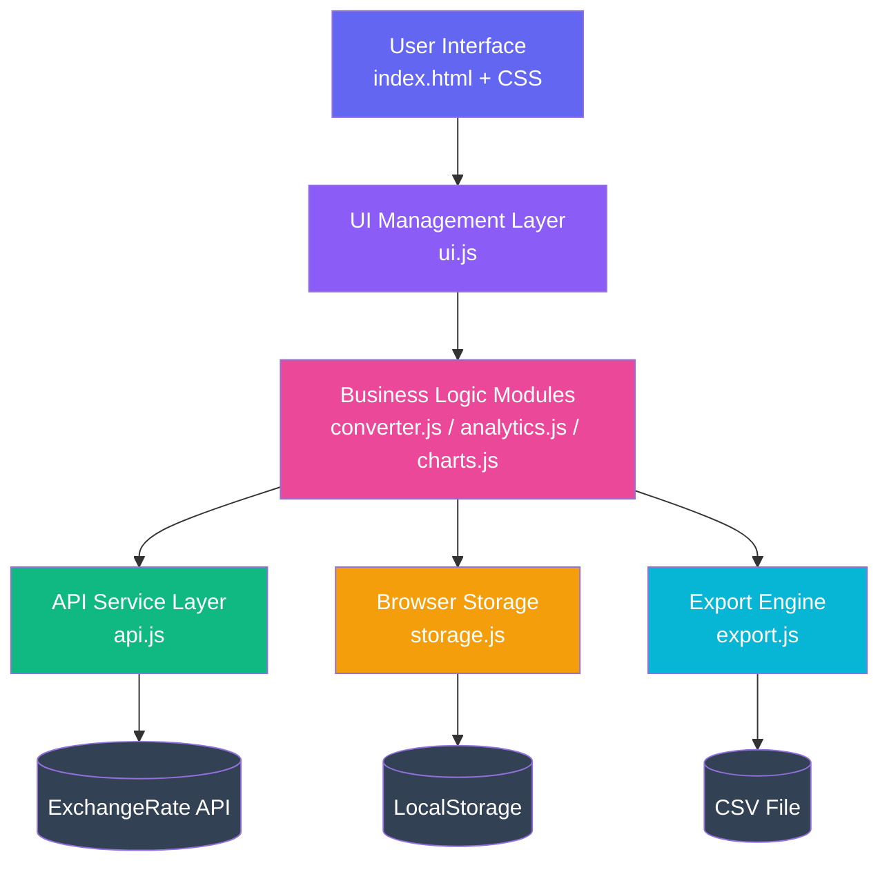
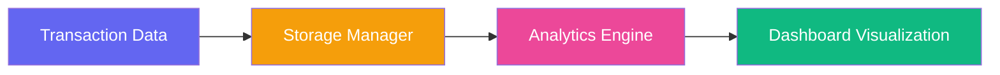

<div align="center">

# 💱 GlobalFX Pro

### Real-Time Global Currency Exchange & Financial Analytics Platform

*A production-grade fintech dashboard engineered with vanilla JavaScript — no frameworks, no shortcuts.*

[](https://developer.mozilla.org/en-US/docs/Web/JavaScript)
[](https://developer.mozilla.org/en-US/docs/Web/HTML)
[](https://developer.mozilla.org/en-US/docs/Web/CSS)
[](https://www.chartjs.org/)
[](https://github.com/tanmaytyagii/GlobalFX-Pro)
[](LICENSE)

[](https://github.com/tanmaytyagii/GlobalFX-Pro.git)
[](https://github.com/tanmaytyagii/GlobalFX-Pro/stargazers)
[](https://github.com/tanmaytyagii/GlobalFX-Pro/issues)

[Live Demo](#) · [Report Bug](https://github.com/tanmaytyagii/GlobalFX-Pro/issues) · [Request Feature](https://github.com/tanmaytyagii/GlobalFX-Pro/issues)

</div>

---

## 📸 Product Showcase

<div align="center">

| Dashboard Overview | Currency Converter |
|:---:|:---:|
|  |  |

| Analytics Dashboard | Historical Charts |
|:---:|:---:|
|  |  |

| Mobile Responsive View |
|:---:|
|  |

</div>


---

## 🎯 Product Overview

**GlobalFX Pro** is a real-time currency exchange and financial analytics platform built to demonstrate how a modern fintech product — comparable in spirit to **Wise, Revolut, Stripe, and Google Finance** — can be engineered entirely on the frontend using disciplined, modular vanilla JavaScript.

### The Problem

Cross-border commerce, remote payroll, freelance invoicing, and personal travel all require fast, accurate, and transparent currency conversion. Most "quick converter" tools online are single-purpose, offer no historical context, and give users no way to understand *why* a rate moved or *how* their own conversion behavior trends over time. GlobalFX Pro closes that gap by pairing a conversion engine with a full analytics layer in one cohesive interface.

### Real-World Use Cases

- **Freelancers & remote workers** reconciling international invoices across currencies
- **Travelers** planning budgets against live exchange rates before a trip
- **Import/export businesses** tracking currency exposure and volatility risk
- **Finance students & analysts** studying historical FX trends across multiple timeframes
- **Personal finance users** maintaining an auditable log of their own conversions

### Target Audience

Individuals and small businesses who need trustworthy, real-time FX data with the analytical depth of an institutional dashboard — without the overhead of a backend account or subscription.

### Why This Application Matters

GlobalFX Pro is positioned as a **fintech dashboard product**, not a demo script. Every engineering decision — caching strategy, offline fallback, modular architecture, CSV export — reflects patterns used in production financial software, making the codebase a realistic reference implementation of client-side fintech engineering.

---

## ⭐ Key Features

| Feature | Description | Engineering Highlight |
|---|---|---|
| **Currency Conversion** | Real-time conversion across all major world currencies with live rate fetching | Intelligent caching layer with offline fallback to minimize API dependency |
| **Analytics Dashboard** | Conversion statistics, most-used currency pairs, and average transaction size | Client-side aggregation engine computed entirely from local transaction history |
| **Market Charts** | Historical trend visualization across 24H / 7D / 30D / 90D / 1Y timeframes | Dynamic Chart.js rendering with gradient fills and theme-aware color systems |
| **Currency Search** | Searchable selector with country flags and code/name matching | Debounced input handling for optimized keystroke-level performance |
| **Theme System** | Seamless dark/light mode switching across the entire interface | CSS custom-property architecture enabling instant, flicker-free theme swaps |
| **Transaction Logs** | Persistent, auditable record of every conversion performed | LocalStorage abstraction layer with structured schema and audit trail |
| **CSV Export** | One-click export of transaction history for offline record-keeping | Native Browser CSV Export API — zero external dependencies |

---

## 🏗️ System Architecture

GlobalFX Pro follows a strict **layered frontend architecture**, separating presentation, orchestration, business logic, external communication, and persistence into independent concerns:

```
User Interface
       │
       ▼
UI Management Layer
       │
       ▼
Business Logic Modules
       │
       ▼
API Service Layer
       │
       ▼
Browser Storage
```

This separation ensures that UI changes never leak into business logic, business logic never talks to the DOM directly, and the API layer is fully swappable without touching the rest of the application.



---

## 🔄 Application Workflow

### Currency Conversion Flow


1. **User Selects Currencies** — Base and target currencies are chosen via the searchable selector
2. **Fetch Exchange Rates** — `api.js` retrieves live rates, checking cache validity first
3. **Process Conversion** — `converter.js` performs the calculation and formats the result
4. **Save Transaction** — The conversion record is persisted via `storage.js`
5. **Update Analytics** — `analytics.js` recalculates aggregate metrics in real time

### Analytics Flow



1. **Transaction Data** — Raw conversion events generated during app usage
2. **Storage Manager** — `storage.js` normalizes and persists records to LocalStorage
3. **Analytics Engine** — `analytics.js` computes trends, frequency, and volatility scores
4. **Dashboard Visualization** — `charts.js` and `ui.js` render the results as live charts and metrics

---

## 🧩 Technical Architecture — Module Breakdown

The application is intentionally split into single-responsibility ES6 modules, avoiding the "one giant script.js" anti-pattern common in vanilla JS projects:

| Module | Responsibility |
|---|---|
| **`app.js`** | Application bootstrap — initializes all modules, wires up global event listeners, manages startup sequence |
| **`api.js`** | Handles all external communication with the ExchangeRate API — rate fetching, response caching, market data normalization |
| **`converter.js`** | Core conversion calculations and transaction object creation |
| **`analytics.js`** | Computes user-level analytics and market-level metrics (volatility, movers, risk classification) |
| **`charts.js`** | Owns all Chart.js instances — creation, updates, timeframe switching, theme synchronization |
| **`storage.js`** | Abstracts all LocalStorage reads/writes behind a clean API, decoupling persistence from business logic |
| **`export.js`** | Generates and triggers download of CSV files from transaction history |
| **`ui.js`** | Renders dynamic UI, manages dropdowns, search interactions, and DOM event delegation |

This modular boundary means any single module can be unit-tested, replaced, or extended (e.g., swapping `storage.js` for an IndexedDB or backend-backed implementation) without cascading changes across the codebase.

---

## 🛠️ Tech Stack

| Category | Technology | Purpose |
|---|---|---|
| **Frontend** | HTML5 | Semantic markup and application structure |
| **Styling** | CSS3 (Custom Properties, Grid, Flexbox) | Responsive layout, theming, glassmorphism design system |
| **Programming** | JavaScript (ES6+ Modules) | Application logic, state management, DOM orchestration |
| **Visualization** | Chart.js | Interactive historical and analytical financial charts |
| **API** | ExchangeRate API | Real-time and historical currency exchange rate data |
| **Browser Storage** | LocalStorage API | Client-side persistence of transaction history and preferences |

---

## 📁 Project Structure

```
globalfx-pro/
│
├── index.html                 # Application entry point
│
├── css/
│   ├── style.css               # Core design system & layout
│   ├── animations.css          # Transition & motion library
│   └── responsive.css          # Breakpoint & mobile-first rules
│
├── js/
│   ├── app.js                  # Application bootstrap & initialization
│   ├── api.js                  # API communication, caching, market data
│   ├── converter.js            # Conversion logic & transaction handling
│   ├── analytics.js            # User & market analytics engine
│   ├── charts.js               # Chart.js rendering & visualization management
│   ├── storage.js              # LocalStorage abstraction layer
│   ├── export.js                # CSV generation & export
│   └── ui.js                   # UI rendering & interaction handling
│
├── screenshots/                # Product screenshots for documentation
└── README.md
```

Each module maps directly to a layer in the [System Architecture](#-system-architecture), keeping the codebase's folder structure a truthful reflection of its runtime architecture.

---

## 🎨 Design System

- **Glassmorphism UI** — Layered translucency, soft shadows, and backdrop blur applied consistently across cards, modals, and navigation
- **CSS Variable Architecture** — A centralized token system (`--color-*`, `--radius-*`, `--shadow-*`) drives every visual property, enabling instant global restyling
- **Responsive Grid Layouts** — CSS Grid and Flexbox combine for a fluid, mobile-first layout that adapts from small phones to ultra-wide displays
- **Theme Switching** — Dark/light mode toggled purely through CSS variable overrides at the `:root` level — no re-render or class-thrashing required
- **Animation Framework** — Dedicated `animations.css` module handles micro-interactions (hover states, transitions, chart entrance animations) separately from layout concerns

---

## 📊 Data Visualization

Built on **Chart.js**, the visualization layer includes:

- **Historical Trend Charts** — Line charts rendering exchange rate movement across selectable timeframes
- **Gradient Fill Charts** — Canvas gradients applied beneath trend lines for a premium, modern fintech aesthetic
- **Responsive Canvas Rendering** — Charts resize fluidly with the viewport and container without distortion
- **Dynamic Theme Support** — Chart colors, gridlines, and tooltips automatically re-theme when the user toggles dark/light mode
- **Custom Tooltip Design** — Tooltips are styled to match the glassmorphism system rather than using Chart.js defaults

---

## ⚡ Performance Optimizations

- **API Response Caching** — Exchange rates are cached with a time-to-live (TTL) policy to minimize redundant network calls
- **Debounced Search** — Currency search input is debounced to prevent excessive re-renders during fast typing
- **Modular JavaScript Loading** — ES6 modules are loaded on-demand where applicable, reducing initial parse cost
- **LocalStorage Optimization** — Transaction records are batched and normalized before persistence to avoid write amplification
- **Reduced API Call Volume** — Cache-first strategy ensures the app only calls the ExchangeRate API when data is stale or missing

---

## 🔒 Security Considerations

- **API Key Protection** — API keys should never be committed to source control; use environment-specific config or a proxy layer in production deployments
- **Input Validation** — All user inputs (currency codes, amounts) are validated and sanitized before processing
- **Safe LocalStorage Handling** — Data written to LocalStorage is JSON-validated on read to prevent corrupted-state crashes
- **XSS Prevention** — All dynamic content is inserted using safe DOM APIs rather than unsanitized `innerHTML` concatenation

---

## 🚀 Installation & Setup

**1. Clone the repository**

```bash
git clone https://github.com/tanmaytyagii/GlobalFX-Pro.git
```

**2. Navigate into the project directory**

```bash
cd globalfx-pro
```

**3. Run the application**

Option A — Open directly in the browser:

```bash
open index.html
```

Option B — Serve locally (recommended for full API behavior):

```bash
npx http-server
```

The app will be available at the local address printed in your terminal (typically `http://localhost:8080`).

---

## 🔮 Future Enhancements

- 🤖 **AI Currency Prediction** — Predictive rate modeling using historical trend data
- 📈 **Machine Learning Forex Forecasting** — ML-driven forecasting models for short-term rate movement
- 💼 **Portfolio Tracking** — Multi-currency holdings and net worth tracking
- 🔔 **Real-Time Notifications** — Rate-alert system for target thresholds
- 📱 **Progressive Web App** — Installable, offline-first PWA support
- 🔐 **Authentication System** — User accounts with secure session management
- ☁️ **Cloud Database** — Migration from LocalStorage to a persistent cloud-backed store
- 📊 **Advanced Market Indicators** — RSI, moving averages, and volatility bands
- 🧠 **AI Financial Assistant** — Conversational assistant for FX insights and conversion queries

---

## 🧠 Skills Demonstrated

**Frontend Engineering**
- Responsive, mobile-first design
- Modular JavaScript architecture (ES6 modules)
- Scalable UI architecture without a framework

**FinTech Engineering**
- Currency conversion systems
- Market analytics & volatility scoring
- Financial data visualization

**Software Engineering**
- Third-party API integration & caching strategy
- Structured client-side data handling
- Performance optimization under real-world constraints

---

## 🤝 Contribution Guidelines

Contributions are welcome and appreciated. To contribute:

1. **Fork** the repository
2. **Create a feature branch**
   ```bash
   git checkout -b feature/your-feature-name
   ```
3. **Commit your changes** with clear, descriptive messages
   ```bash
   git commit -m "feat: add volatility scoring to analytics engine"
   ```
4. **Push to your fork**
   ```bash
   git push origin feature/your-feature-name
   ```
5. **Open a Pull Request** describing the change, motivation, and testing performed

Please ensure new code follows the existing modular structure and includes relevant inline documentation.

---

## 👤 Author

**Tanmay Tyagi**
B.Tech Computer Science Engineering (AI/ML)

[](https://github.com/tanmaytyagii)
[](https://linkedin.com/in/tyagitanmay)

---

## 📄 License

This project is licensed under the **MIT License** — see the [LICENSE](LICENSE) file for details.

---

<div align="center">

### ⭐ If you like this project, consider giving it a star!

Made with precision and a genuine appreciation for fintech engineering.

</div>
